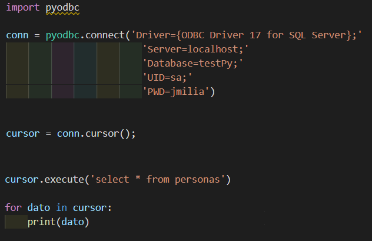

# TPs-Lab3
### Uso de libreria "Pyodbc"
1. Verificar si tiene instalado Python en su Pc, en caso de no tenerlo,
   le dejo el link: [Download Python](https://www.python.org/downloads)
2. Una vez instalado, para ver si se instalo, en Cmd poner: **python 
--version** 
3. Ahora pasamos a instalar la libreria Pyodbc, para ello hacemos:
	* Desde la terminal de VS code, colocamos **pip install pyodbc**
	* Para chequear que se ha instalado colocamos **pip3 freeze**
4. Y ahora en link que le adjutare, va ser necesario la descarga e 
instalacion del Driver del Sql para establecer la comunicion de las 
peticiones que se vayan a realizar en el archivo .py: 
	* [Driver Sql para Windows](https://docs.microsoft.com/en-us/sql/connect/odbc/windows/system-requirements-installation-and-driver-files?view=sql-server-ver15#installing-microsoft-odbc-driver-for-sql-server) 
	* [Driver Sql para Linux](https://docs.microsoft.com/en-us/sql/connect/odbc/linux-mac/installing-the-microsoft-odbc-driver-for-sql-server?view=sql-server-ver15) 

5. Configurar el archivo .py para obtener acceso a los registros a la 
base de datos, en este caso se usara SQL SERVER como ejemplo:

Hacer un import pyodbc para usar las funciones que tiene dicha libreria, 
en el **pyodbc.connect** se debe colocar un string con los siguientes datos: 
* Driver -> es el nombre del driver que se instalo en el Paso 4 
* Server -> por defecto es localhost, que es el nombre del servidor 
	  del Sql Server
* Database -> es el nombre de la base de datos que creamos
* UID -> es el nombre de usuario de la base de datos
* PWD -> es la password de la base de datos

En **conn.cursor()** va obtiendo los datos del registro, **cursor.execute()**
se puede realizar la consulta, insercion, eliminacion o actualizacion de
un registro de la tabla de la base de datos.
Y el for, en caso de haber mas de un registro, los muestre a todos.

NOTA: En caso necesario se le adjuntara un link con la documentacion de 
la libraria: [Documentacion](https://github.com/mkleehammer/pyodbc/wiki)
